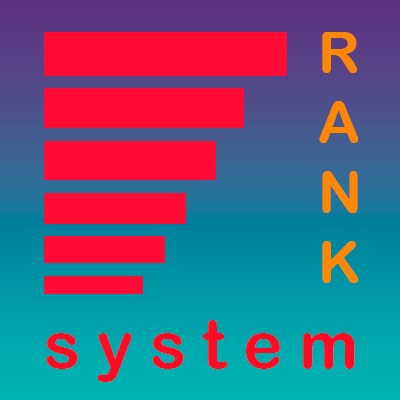

# RankSystem


Hello here
### This is paper plugin for ranks

> __About__<br>
> Minecraft version: __1.19+__<br>
> Core: __paper__

## How to install 
- Create [paper](https://papermc.io) server 
- Download latest version of my plugin
- Add plugin in *plugins* directory
- Create [mysql](https://www.mysql.com) database
## Commands
 
>__Discord__ <br> Command to work with [discord bot](https://github.com/dgudim/Discord-minerank-bot)<br>
>__Rank__ <br> Command to show player's rank

## Config
- __tableName__: Name of the database table 
- __chatActivityRatio__ and __gameActivityRatio__ it is cofficients for ranks
- __db__ it is database settings
- __discordAnnoyMessage__ this message for annoy people for adding discord account
- __discordLinkMessage__ this message for copy link to add discord account
- For using last to parameters you will use with [discord bot](https://github.com/dgudim/Discord-minerank-bot)<br>

### Defalut
`config.yml`
```yaml

tableName: "players"
chatActivityRatio: 0.5
gameActivityRatio: 0.5
db:
  host: "localhost"
  port: "3307"
  dbName: "rank-system"
  login: "rankSystemPlugin"
  password: "12345678"

discordAnnoyMessage:
- |-
You haven't linked a discord
If you link a discord, we will be able to give you a rank on our discord server
discordLinkMessage:
  - |-
    To bind the discord, [copy] the id and write to our bot /minecraft <your-id>
    The bot is located on our discord server https://discord .gg/sKgypSe7gW

```


